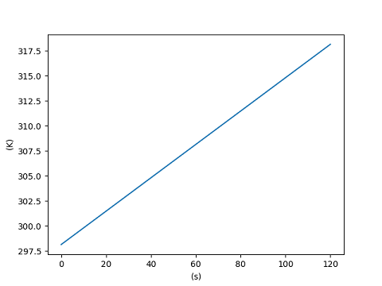
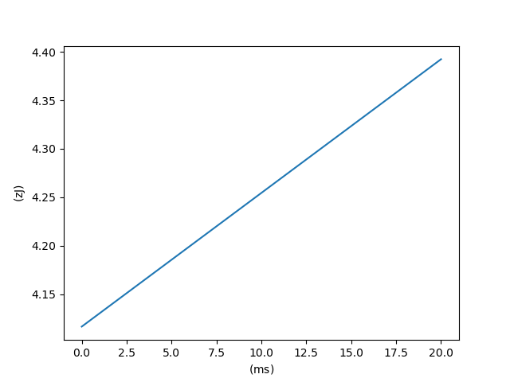
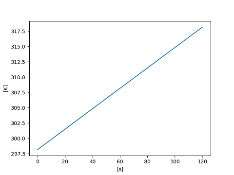

========================
Working with :mod:`unyt`
========================

Basic Usage
+++++++++++

To use unyt in a project::

  >>> import unyt

The top-level :mod:`unyt` namespace defines both a number of useful functions as
well as a number of units and physical constants populated from the
:mod:`unyt.unit_symbols` and :mod:`unyt.physical_constants` namespaces you can
use to attach units to NumPy arrays and other common python data container types
like ``list`` and ``tuple``. For an exhaustive listing of units and physical
constants defined in :mod:`unyt`, see :ref:`unit-listing`.

An Example from High School Physics
-----------------------------------

To see how you might use :mod:`unyt` to solve a problem where units might be a
headache, let's estimate the orbital periods of Jupiter's Galilean moons,
assuming they have circular orbits and their masses are negligible compared to
Jupiter. Under these assumptions, the orbital period is

.. math::

   T = 2\pi\left( \frac{r^3}{GM}\right)^{1/2}.

For this exercise let's calculate the orbital period in days. While it's
possible to do this using plain old floating point numbers (you probably had to
do something similar on a calculator in a high school physics class, looking up
and plugging in conversion factors by hand), it's much easier to do this sort of
thing symbolically and let :mod:`unyt` handle the unit conversions.

To do this we'll need to know the mass of Jupiter (fortunately that is built
into :mod:`unyt`) and the semimajor axis of the orbits of Jupiter's moons, which
we can look up from `Wikipedia
<https://en.wikipedia.org/wiki/Moons_of_Jupiter#List>`_ and enter by hand::

  >>> from unyt import Mjup, G, AU
  >>> from math import pi
  ...
  >>> moons = ['Io', 'Europa', 'Ganymede', 'Callisto']
  >>> semimajor_axis = [.002819, .0044856, .00715526, .01258513]*AU
  ...
  >>> period = 2*pi*(semimajor_axis**3/(G*Mjup))**0.5
  >>> period = period.to('d')
  ...
  >>> for moon, period in zip(moons, period):
  ...     print('{}: {:04.2f}'.format(moon, period))
  Io: 1.77 day
  Europa: 3.55 day
  Ganymede: 7.15 day
  Callisto: 16.69 day

Let's break up this example into a few components so you can see what's going
on. First, we import the unit symbols we need from the :mod:`unyt` namespace::

  >>> from unyt import Mjup, G, km

The :mod:`unyt` namespace has a large number of units and physical constants you
can import to apply units to data in your own code. You can see how that works
in the example::

  >>> semimajor_axis = [.002819, .0044856, .00715526, .01258513]*AU
  >>> semimajor_axis
  unyt_array([0.002819  , 0.0044856 , 0.00715526, 0.01258513], 'AU')

By multiplying by ``km``, we converted the python list into a
:class:`unyt.unyt_array <unyt.array.unyt_array>` instance. This is a class
that's built into :mod:`unyt`, has units attached to it, and knows how to
convert itself into different dimensionally equivalent units::

  >>> semimajor_axis.value
  array([0.002819  , 0.0044856 , 0.00715526, 0.01258513])
  >>> semimajor_axis.units
  AU
  >>> print(semimajor_axis.to('km'))
  [ 421716.39764641  671036.20903964 1070411.66066813 1882708.6511216 ] km

Next, we calculated the orbital period by translating the orbital period
formula to Python and then converting the answer to the units we want in the
end, days::

  >>> period = 2*pi*(semimajor_axis**3/(G*Mjup))**0.5
  >>> period
  unyt_array([ 152864.59689789,  306828.08975058,  618162.17963649,
              1441952.18891597], 's')
  >>> period.to('d')
  unyt_array([ 1.76926617,  3.55125104,  7.15465486, 16.68926145], 'day')

Note that we haven't added any conversion factors between different units,
that's all handled internally by :mod:`unyt`. Also note how the
:meth:`unyt_array.to <unyt.array.unyt_array.to>` method was able to
automatically handle the conversion from seconds to days and how the
shorthand ``"d"`` was automatically interpreted as ``"day"``.

Arithmetic and units
--------------------

The real power of working with :mod:`unyt` is its ability to add, subtract,
multiply, and divide quantities and arrays with units in mathematical formulas
while automatically handling unit conversions and detecting when you have made a
mistake in your units in a mathematical formula. To see what I mean by that,
let's take a look at the following examples::

  >>> from unyt import cm, m, ft, yard
  >>> print(3.*cm + 4.*m - 5.*ft + 6.*yard)
  799.24 cm

Despite the fact that the four unit symbols used in the above example correspond
to four different units, :mod:`unyt` is able to automatically convert the value
of all three units into a common unit and return the result in those units. Note
that for expressions where the return units are ambiguous, :mod:`unyt` always
returns data in the units of the leftmost object in an expression::

  >>> print(4*m + 3*cm - 5*ft + 6*yard)  # doctest: +FLOAT_CMP
  7.9924 m

One can also form more complex units out of atomic unit symbols. For example,
here is how we'd create an array with units of meters per second and print out
the values in the array in miles per hour::

  >>> from unyt import m, s
  >>> velocities = [20., 22., 25.]*m/s
  >>> print(velocities.to('mile/hr'))
  [44.73872584 49.21259843 55.9234073 ] mile/hr

Similarly one can multiply two units together to create new compound units::

  >>> from unyt import N, m
  >>> energy = 3*N * 4*m
  >>> print(energy)
  12 N*m
  >>> print(energy.to('erg'))
  120000000.0 erg

In general, one can multiply or divide by an arbitrary rational power of a unit
symbol. Most commonly this shows up in mathematical formulas in terms of square
roots. For example, let's calculate the gravitational free-fall time for a
person to fall from the surface of the Earth through to a hole dug all the way
to the center of the Earth. It turns out that this time `is given by
<https://en.wikipedia.org/wiki/Free-fall_time>`_:

.. math::

   t_{\rm ff} = \sqrt{\frac{3\pi}{32 G \rho}}

where :math:`\rho` is the average density of the Earth.

  >>> from unyt import G, Mearth, Rearth
  >>> from math import pi
  >>> import numpy as np
  ...
  >>> rho = Mearth / (4./3 * pi* Rearth**3)
  >>> print(rho.to('g/cm**3'))
  5.581225129861083 g/cm**3
  >>> tff = np.sqrt(3*pi/(32*G*rho))
  >>> print(tff.to('min'))
  14.820022043294829 min

If you make a mistake by adding two things that have different dimensions,
:mod:`unyt` will raise an error to let you know that you have a bug in your
code:

  >>> from unyt import kg, m
  >>> 3*kg + 5*m  # doctest: +ELLIPSIS +NORMALIZE_WHITESPACE +IGNORE_EXCEPTION_DETAIL
  Traceback (most recent call last):
  ...
  unyt.exceptions.UnitOperationError: The <ufunc 'add'> operator for
  unyt_arrays with units "kg" (dimensions "(mass)") and
  "m" (dimensions "(length)") is not well defined.

while this example is trivial when one writes more complicated formulae it can
be easy to accidentally write expressions that are not dimensionally sound.

Sometimes this can be annoying to deal with, particularly if one is mixing data
that has units attached with data from some outside source with no units. To
quickly patch over this lack of unit metadata (which could be applied by
explicitly attaching units at I/O time), one can use the ``units`` attribute of
the :class:`unyt.unyt_array <unyt.array.unyt_array>` class to quickly apply units to a scalar, list, or array:

  >>> from unyt import cm, s
  >>> velocities = [10, 20, 30] * cm/s
  >>> velocities + 12  # doctest: +ELLIPSIS +NORMALIZE_WHITESPACE +IGNORE_EXCEPTION_DETAIL
  Traceback (most recent call last):
  ...
  unyt.exceptions.UnitOperationError: The <ufunc 'add'> operator for
  unyt_arrays with units "cm/s" (dimensions "(length)/(time)") and
  "dimensionless" (dimensions "1") is not well defined.
  >>> velocities + 12*velocities.units
  unyt_array([22, 32, 42], 'cm/s')

Powers, Logarithms, Exponentials, and Trigonometric Functions
-------------------------------------------------------------

The :mod:`unyt` library represents powers using standard python syntax. This
means you must use `**` and not `^`, even when writing a unit as a string:

  >>> from unyt import kg, m
  >>> print((10.*kg/m**3).to('g/cm**3'))
  0.01 g/cm**3

Formally it does not make sense to exponentiate, take the logarithm of, or apply
a transcendental function to a quantity with units. However, the :mod:`unyt`
library makes the practical affordance to allow this, simply ignoring the units
present and returning a result without units. This makes it easy to work with
data that has units both in linear space and in log space:

  >>> from unyt import g, cm
  >>> import numpy as np
  >>> print(np.log10(1e-23*g/cm**3))
  -23.0

The one exception to this rule is for trigonometric functions applied to data with angular units:

  >>> from unyt import degree, radian
  >>> import numpy as np
  >>> np.sin(np.pi/4*radian)
  array(0.70710678)
  >>> np.sin(45.*degree)
  array(0.70710678)

Printing Units
--------------

The print formatting of :class:`unyt_array <unyt.array.unyt_array>` can be
controlled identically to numpy arrays, using ``numpy.setprintoptions``:

  >>> import numpy as np
  >>> import unyt as u
  ...
  >>> np.set_printoptions(precision=4)
  >>> print([1.123456789]*u.km)
  [1.1235] km
  >>> np.set_printoptions(precision=8)

Print a :math:`\rm{\LaTeX}` representation of a set of units using the
:meth:`unyt.unit_object.Unit.latex_representation` function or
:attr:`unyt.unit_object.Unit.latex_repr` attribute:

  >>> from unyt import g, cm
  >>> (g/cm**3).units.latex_representation()
  '\\frac{\\rm{g}}{\\rm{cm}^{3}}'
  >>> (g/cm**3).units.latex_repr
  '\\frac{\\rm{g}}{\\rm{cm}^{3}}'

Simplifying Units
-----------------

Unit expressions can often be simplified to cancel pairs of factors with
compatible dimensions. For example, we can form a unit with dimensions of length
by dividing a unit with dimensions of length squared by another unit with
dimensions of length::

  >>> from unyt import m, cm
  >>> m**2/cm
  m**2/cm

The :class:`Unit <unyt.unit_object.Unit>` class has a :meth:`simplify()
<unyt.unit_object.Unit.simplify>` method that we can call to create a new unit
object to that includes the dimensionless ratio ``m/cm`` as a constant
coefficient::

  >>> (m**2/cm).simplify()
  100*m

This will also work for units that are the reciprocals of each other, for example:

  >>> from unyt import s, Hz
  >>> (s*Hz).simplify()
  (dimensionless)

Products and quotients of unit objects will not be simplified unless
``simplify()`` is called explicitly. However, products and quotients of arrays
and quantities will be simplified to make interactive work more intuitive::

  >>> from unyt import erg, minute, hour
  >>> power = [20, 40, 80] * erg / minute
  >>> elapsed_time = 3*hour
  >>> print(power*elapsed_time)
  [ 3600.  7200. 14400.] erg

Checking Units
--------------

If you write a function that accepts data with units as an argument or returns data with units,
you can ensure the dimensional correctness of the inputs or outputs
using the :meth:`@accepts <unyt.dimensions.accepts>` and :meth:`@returns <unyt.dimensions.returns>` decorators::

  >>> from unyt.dimensions import length, time
  >>> from unyt import accepts, returns
  >>> import unyt as u
  >>> @returns(length)
  ... @accepts(a=time, v=length/time)
  ... def foo(a, v):
  ...     return a * v
  ...
  >>> res = foo(a= 2 * u.s, v = 3 * u.m/u.s)
  >>> print(res)
  6 m

.. note::
   Using these decorators may incur some performance overhead, especially for small arrays.

Unit Conversions and Unit Systems
+++++++++++++++++++++++++++++++++

Converting Data to Arbitrary Units
----------------------------------

If you have some data that you want to convert to a different set of units and
you know which units you would like to convert it to, you can make use of the
:meth:`unyt_array.to <unyt.array.unyt_array.to>` function:

  >>> from unyt import mile
  >>> (1.0*mile).to('ft')
  unyt_quantity(5280., 'ft')

If you try to convert to a unit with different dimensions, :mod:`unyt` will
raise an error:

  >>> from unyt import mile
  >>> (1.0*mile).to('lb')  # doctest: +ELLIPSIS +NORMALIZE_WHITESPACE +IGNORE_EXCEPTION_DETAIL
  Traceback (most recent call last):
  ...
  unyt.exceptions.UnitConversionError: Cannot convert between 'mile' (dim
  '(length)') and 'lb' (dim '(mass)').

While we recommend using :meth:`unyt_array.to <unyt.array.unyt_array.to>` in
most cases to convert arrays or quantities to different units, if you would like
to explicitly emphasize that this operation has to do with units, we also
provide the more verbose name :meth:`unyt_array.in_units
<unyt.array.unyt_array.in_units>` which behaves identically to
:meth:`unyt_array.to <unyt.array.unyt_array.to>`.

Converting Units In-Place
-------------------------

The :meth:`unyt_array.to <unyt.array.unyt_array.to>` method makes a copy of the
array data. For most cases this is fine, but when dealing with big arrays, or
when performance is a concern, it sometimes is preferable to convert the data in
an array in-place, without copying the data to a new array. This can be
accomplished with the :meth:`unyt_array.convert_to_units
<unyt.array.unyt_array.convert_to_units>` function:

  >>> from unyt import mile
  >>> data = [1., 2., 3.]*mile
  >>> data
  unyt_array([1., 2., 3.], 'mile')
  >>> data.convert_to_units('km')
  >>> data
  unyt_array([1.609344, 3.218688, 4.828032], 'km')

Converting to MKS and CGS Base Units
------------------------------------

If you don't necessarily know the units you want to convert data to ahead of
time, it's often convenient to specify a unit system to convert to. The
:class:`unyt_array <unyt.array.unyt_array>` has built-in conversion methods for
the two most popular unit systems, MKS (meter kilogram second) and CGS
(centimeter gram second). For CGS these are :meth:`unyt_array.in_cgs
<unyt.array.unyt_array.in_cgs>` and :meth:`unyt_array.convert_to_cgs
<unyt.array.unyt_array.convert_to_cgs>`. These functions create a new copy of an
array in CGS units and convert an array in-place to CGS. respectively. For MKS,
there are the :meth:`unyt_array.in_mks <unyt.array.unyt_array.in_mks>`
and :meth:`unyt_array.convert_to_mks <unyt.array.unyt_array.convert_to_mks>` methods, which play analogous roles.

See below for details on CGS and MKS electromagnetic units.

Other Unit Systems
------------------

The :mod:`unyt` library currently has built-in support for a number of unit
systems, as detailed in the table below. Note that all unit systems currently
use "radian" as the base angle unit.

If a unit system in the table below has "Other Units" specified, this is a
mapping from dimension to a unit name. These units override the unit system's
default unit for that dimension. If no unit is explicitly specified of a
dimension then the base unit for that dimension is calculated at runtime by
combining the base units for the unit system into the appropriate dimension.

+--------------+--------------------+--------------------------+
| Unit system  | Base Units         | Other Units              |
+==============+====================+==========================+
| cgs          | cm, g, s           | * Energy: erg            |
|              |                    | * Specific Energy: erg/g |
|              |                    | * Pressure: dyne/cm**2   |
|              |                    | * Force: dyne            |
|              |                    | * Power: erg/s           |
|              |                    | * Magnetic Field: G      |
|              |                    | * Charge: esu            |
|              |                    | * Current: statA         |
+--------------+--------------------+--------------------------+
| mks          | m, kg, s           | * Energy: J              |
|              |                    | * Specific Energy: J/kg  |
|              |                    | * Pressure: Pa           |
|              |                    | * Force: N               |
|              |                    | * Power: W               |
|              |                    | * Magnetic Field: T      |
|              |                    | * Charge: C              |
+--------------+--------------------+--------------------------+
| imperial     | ft, lb, s          | * Energy: ft*lbf         |
|              |                    | * Temperature: R         |
|              |                    | * Pressure: lbf/ft**2    |
|              |                    | * Force: lbf             |
|              |                    | * Power: hp              |
+--------------+--------------------+--------------------------+
| galactic     | kpc, Msun, kyr     | * Energy: kev            |
|              |                    | * Magnetic Field: uG     |
+--------------+--------------------+--------------------------+
| solar        | AU, Mearth, yr     |                          |
+--------------+--------------------+--------------------------+

Note that in MKS units the current unit, Ampere, is a base unit in the unit
system. In CGS units the electromagnetic units like Gauss and statA are
decomposable in terms of the base mass, length, and time units in the unit
system. For this reason quantities defined in E&M units in CGS units are not
readily convertible to MKS units and vice verse since the units are not
dimensionally equivalent. The :mod:`unyt` library does have limited support for converting electromagnetic units between MKS and CGS, however only simple conversions of data with a single specific unit are supported and no conversions are allowed for complex combinations of units. For example converting between Gauss and Tesla is supported:

  >>> from unyt import T
  >>> (1.0*T).to('G')
  unyt_quantity(10000., 'G')

But converting a more complicated compound unit will raise an error:

  >>> from unyt import C, T, V
  >>> (1.0*C*T*V).in_cgs()  # doctest: +ELLIPSIS +NORMALIZE_WHITESPACE +IGNORE_EXCEPTION_DETAIL
  Traceback (most recent call last):
  ...
  unyt.exceptions.UnitsNotReducible: The unit "C*T*V" (dimensions
  "(length)**2*(mass)**2/((current_mks)*(time)**4)") cannot be reduced to
  an expression within the cgs system of units.

If you need to work with complex expressions involving electromagnetic units, we
suggest sticking to either CGS or SI units for the full calculation. There is no
general way to convert an arbitrary quantity between CGS and SI units if the
quantity involves electromagnetic units. Instead, it is necessary to do the
conversion on the equations under consideration, and then recompute the
necessary quantity in the transformed set of equations. This requires
understanding the context for a calculation, which unfortunately is beyond the
scope of a library like :mod:`unyt`.

You can convert data to a unit system :mod:`unyt` knows about using the
:meth:`unyt_array.in_base <unyt.array.unyt_array.in_base>` and
:meth:`unyt_array.convert_to_base <unyt.array.unyt_array.convert_to_base>`
methods:

  >>> from unyt import g, cm, horsepower
  >>> (1e-9*g/cm**2).in_base('galactic')
  unyt_quantity(4.78843804, 'Msun/kpc**2')
  >>> data = [100., 500., 700.]*horsepower
  >>> data
  unyt_array([100., 500., 700.], 'hp')
  >>> data.convert_to_base('mks')
  >>> data
  unyt_array([ 74569.98715823, 372849.93579114, 521989.91010759], 'W')

Defining and Using New Unit Systems
***********************************

To define a new custom unit system, one need only create a new instance of the
:class:`unyt.UnitSystem <unyt.unit_systems.UnitSystem>` class. The class
initializer accepts a set of base units to define the unit system. If you would
like to additionally customize any derived units in the unit system, you can do
this using item setting.

As an example, let's define an atomic unit system based on typical scales for
atoms and molecules:

   >>> from unyt import UnitSystem
   >>> atomic_unit_system = UnitSystem('atomic', 'nm', 'mp', 'fs', 'nK', 'rad')
   >>> atomic_unit_system['energy'] = 'eV'
   >>> atomic_unit_system
   atomic Unit System
    Base Units:
     length: nm
     mass: mp
     time: fs
     temperature: nK
     angle: rad
     current_mks: A
     luminous_intensity: cd
    Other Units:
     energy: eV
   >>> print(atomic_unit_system)
   atomic
   >>> atomic_unit_system['number_density']
   nm**(-3)
   >>> atomic_unit_system['angular_momentum']
   mp*nm**2/fs

It is also legal to define a unit system using :class:`unyt.Unit
<unyt.unit_object.Unit>` instances:

  >>> from unyt.unit_symbols import Msun, second, megaparsec
  >>> UnitSystem('cosmological', megaparsec, Msun, second)
    cosmological Unit System
     Base Units:
      length: Mpc
      mass: Msun
      time: s
      temperature: K
      angle: rad
      current_mks: A
      luminous_intensity: cd
     Other Units:

Or with a quantity:

  >>> UnitSystem('quasmological', 3*megaparsec, .8*Msun, 42*second)
    quasmological Unit System
     Base Units:
      length: 3*Mpc
      mass: 0.8*Msun
      time: 42*s
      temperature: K
      angle: rad
      current_mks: A
      luminous_intensity: cd
     Other Units:

Once you have defined a new unit system that will register the new system with a
global registry of unit systems known to the :mod:`unyt` library. That means you
will immediately be able to use it just like the built-in unit systems:

  >>> from unyt import W
  >>> (1.0*W).in_base('atomic')
  unyt_quantity(0.59746607, 'mp*nm**2/fs**3')

If you would like your unit system to include an MKS current unit
(e.g. something that is directly convertible to the MKS Ampere unit), then
specify a ``current_mks_unit`` in the :class:`UnitSystem
<unyt.unit_systems.UnitSystem>` initializer.

Equivalencies
+++++++++++++

An equivalency is a way to define a mapping to convert from one unit to another
even if the two units are not dimensionally equivalent. This usually involves
some sort of shorthand or heuristic understanding of the problem under
consideration. Only use one of these equivalencies if it makes sense to use it
for the problem you are working on.

The :mod:`unyt` library implements the following equivalencies:

* ``"thermal"``: conversions between temperature and energy (:math:`E = k_BT`)
* ``"spectral"``: conversions between wavelength, spatial frequency, frequency,
  and energy for photons (:math:`E = h\nu = hc/\lambda`, :math:`c = \lambda\nu`)
* ``"mass_energy"``: conversions between mass and energy (:math:`E = mc^2`)
* ``"lorentz"``: conversions between velocity and Lorentz factor (:math:`\gamma
  = 1/\sqrt{1-(v/c)^2}`)
* ``"schwarzschild"``: conversions between mass and Schwarzschild radius
  (:math:`R_S = 2GM/c^2`)
* ``"compton"``: conversions between mass and Compton wavelength (:math:`\lambda
  = h/mc`)

You can convert data to a specific set of units via an equivalency appropriate
for the units of the data. To see the equivalencies that are available for an
array, use the :meth:`unit_array.list_equivalencies
<unyt.array.unyt_array.list_equivalencies>` method:

  >>> from unyt import gram, km
  >>> gram.list_equivalencies()
  mass_energy: mass <-> energy
  schwarzschild: mass <-> length
  compton: mass <-> length
  >>> km.list_equivalencies()
  spectral: length <-> spatial_frequency <-> frequency <-> energy
  schwarzschild: mass <-> length
  compton: mass <-> length

All of the unit conversion methods described above have an ``equivalence``
keyword argument that allows one to optionally specify an equivalence to use for
the unit conversion operation. For example, let's use the ``schwarzschild``
equivalence to calculate the mass of a black hole with a radius of one AU:

  >>> from unyt import AU
  >>> (1.0*AU).to('Msun', equivalence='schwarzschild')
  unyt_quantity(50656851.7815179, 'Msun')

Both the methods that convert data in-place and the ones that return a copy
support optionally specifying equivalence. In addition to the methods described
above, :mod:`unyt` also supplies two more conversion methods that *require* an
equivalence to be specified: :meth:`unyt_array.to_equivalent
<unyt.array.unyt_array.to_equivalent>` and
:meth:`unyt_array.convert_to_equivalent
<unyt.array.unyt_array.convert_to_equivalent>`. These are identical to their
counterparts described above, except they equivalence is a required positional
argument to the function rather than an optional keyword argument. Use these
functions when you want to emphasize that an equivalence is being used.

If the equivalence has optional keyword arguments, these can be passed to the
unit conversion function. For example, here's an example where we specify a
custom mean molecular weight (``mu``) for the ``number_density`` equivalence:

  >>> from unyt import g, cm
  >>> rho = 1e-23 * g/cm**3
  >>> rho.to('cm**-3', equivalence='number_density', mu=1.4)
  unyt_quantity(4.26761476, 'cm**(-3)')

For full API documentation and an autogenerated listing of the built-in
equivalencies in :mod:`unyt` as well as a short usage example for each, see the
:mod:`unyt.equivalencies` API listing.

Dealing with code that doesn't use :mod:`unyt`
++++++++++++++++++++++++++++++++++++++++++++++

Optimally, a function will work the same irrespective of whether the data passed in has units attached or not:

    >>> from unyt import cm
    >>> def square(x):
    ...     return x**2
    >>> print(square(3.))
    9.0
    >>> print(square(3.*cm))
    9.0 cm**2

However in the real world that is not always the case. In this section we describe strategies for dealing with that situation.

Stripping units off of data
---------------------------

The :mod:`unyt` library provides a number of ways to convert
:class:`unyt_quantity <unyt.array.unyt_quantity>` instances into floats and
:class:`unyt_array <unyt.array.unyt_array>` instances into numpy arrays. These
methods either return a copy of the data as a numpy array or return a view
onto the underlying array data owned by a :class:`unyt_array
<unyt.array.unyt_array>` instance.

To obtain a new array containing a copy of the original data, use either the
:meth:`unyt_array.to_value <unyt.array.unyt_array.to_value>` function or the
:attr:`unyt_array.value <unyt.array.unyt_array.value>` or :attr:`unyt_array.v
<unyt.array.unyt_array.v>` properties. All of these are equivalent to passing a
:class:`unyt_array <unyt.array.unyt_array>` to the ``numpy.array()`` function:

  >>> from unyt import g
  >>> import numpy as np
  >>> data = [1., 2., 3.]*g
  >>> data
  unyt_array([1., 2., 3.], 'g')
  >>> np.array(data)
  array([1., 2., 3.])
  >>> data.to_value('kg')
  array([0.001, 0.002, 0.003])
  >>> data.value
  array([1., 2., 3.])
  >>> data.v
  array([1., 2., 3.])

Similarly, to obtain a ndarray containing a view of the data in the original
array, use either the :attr:`unyt_array.ndview <unyt.array.unyt_array.ndview>`
or the :attr:`unyt_array.d <unyt.array.unyt_array.d>` properties:

  >>> data.view(np.ndarray)
  array([1., 2., 3.])
  >>> data.ndview
  array([1., 2., 3.])
  >>> data.d
  array([1., 2., 3.])

Applying units to data
----------------------

.. note::

   A numpy array that shares memory with another numpy array points to the array
   that owns the data with the ``base`` attribute. If ``arr1.base is arr2`` is
   ``True`` then ``arr1`` is a view onto ``arr2`` and ``arr2.base`` will be
   ``None``.

When you create a :class:`unyt_array <unyt.array.unyt_array>` instance from a
numpy array, :mod:`unyt` will create a copy of the original array:

  >>> from unyt import g
  >>> data = np.random.random((100, 100))
  >>> data_with_units = data*g
  >>> data_with_units.base is data
  False

If you would like to create a view rather than a copy, you can apply units like this:

  >>> from unyt import unyt_array
  >>> data_with_units = unyt_array(data, g)
  >>> data_with_units.base is data
  True

Any set of units can be used for either of these operations. For example, if
you already have an existing array, you could do this to create a new array
with the same units:

  >>> more_data = [4, 5, 6]*data_with_units.units
  >>> more_data
  unyt_array([4, 5, 6], 'g')

Working with code that uses ``astropy.units``
---------------------------------------------

The :mod:`unyt` library can convert data contained inside of an Astropy
``Quantity`` instance. It can also produce a ``Quantity`` from an existing
:class:`unyt_array <unyt.array.unyt_array>` instance. To convert data from
``astropy.units`` to :mod:`unyt` use the :func:`unyt_array.from_astropy
<unyt.array.unyt_array.from_astropy>` function:

  >>> from astropy.units import km
  >>> from unyt import unyt_quantity
  >>> unyt_quantity.from_astropy(km)
  unyt_quantity(1., 'km')
  >>> a = [1, 2, 3]*km
  >>> a
  <Quantity [1., 2., 3.] km>
  >>> unyt_array.from_astropy(a)
  unyt_array([1., 2., 3.], 'km')

To convert data *to* ``astropy.units`` use the :meth:`unyt_array.to_astropy <unyt.array.unyt_array.to_astropy>` method:

  >>> from unyt import g, cm
  >>> data = [3, 4, 5]*g/cm**3
  >>> data.to_astropy()
  <Quantity [3., 4., 5.] g / cm3>
  >>> (4*cm).to_astropy()
  <Quantity 4. cm>

Working with code that uses ``Pint``
------------------------------------

The :mod:`unyt` library can also convert data contained in ``Pint`` ``Quantity``
instances. To convert data from ``Pint`` to :mod:`unyt`, use the :func:`unyt_array.from_pint <unyt.array.unyt_array.from_pint>` function:

  >>> from pint import UnitRegistry
  >>> import numpy as np
  >>> ureg = UnitRegistry()
  >>> a = np.arange(4)
  >>> b = ureg.Quantity(a, "erg/cm**3")
  >>> b
  <Quantity([0 1 2 3], 'erg / centimeter ** 3')>
  >>> c = unyt_array.from_pint(b)
  >>> c
  unyt_array([0, 1, 2, 3], 'erg/cm**3')

And to convert data contained in a :class:`unyt_array <unyt.array.unyt_array>`
instance, use the :meth:`unyt_array.to_pint <unyt.array.unyt_array.to_pint>`
method:

  >>> from unyt import cm, s
  >>> a = 4*cm**2/s
  >>> print(a)
  4 cm**2/s
  >>> a.to_pint()
  <Quantity(4, 'centimeter ** 2 / second')>
  >>> b = [1, 2, 3]*cm
  >>> b.to_pint()
  <Quantity([1 2 3], 'centimeter')>

User-Defined Units
++++++++++++++++++

Often it is convenient to define new custom units. This can happen when you need
to make use of a unit that the :mod:`unyt` library does not have a definition
for already. It can also happen when dealing with data that uses a custom unit
system or when writing software that needs to deal with such data in a flexible
way, particularly when the units might change from dataset to dataset. This
comes up often when modeling a physical system since it is often convenient to
rescale data from a physical unit system to an internal "code" unit system in
which the values of the variables under consideration are close to unity. This
approach can help minimize floating point round-off error but is often done for
convenience or to non-dimensionalize the problem under consideration.

The :mod:`unyt` library provides two approaches for dealing with this
problem. For more toy one-off use-cases, we suggest using
:func:`unyt.define_unit <unyt.unit_object.define_unit>` which allows defining a
new unit name in the global, default unit system that :mod:`unyt` ships with by
default.

This function makes it possible to easily define a new unit that is unknown to
the :mod:`unyt` library:

  >>> import unyt as u
  >>> two_weeks = 14.0*u.day
  >>> one_day = 1.0*u.day
  >>> u.define_unit("fortnight", two_weeks)
  >>> print((3*u.fortnight)/one_day)
  42.0 dimensionless

This is primarily useful for one-off definitions of units that the :mod:`unyt`
library does not already have predefined. For more complex uses cases that need
more flexibility, it is possible to use a custom unit system by ensuring that
the data you are working with makes use of a :class:`UnitRegistry
<unyt.unit_registry.UnitRegistry>` customized for your use case, as described
below.

Dealing with data types
+++++++++++++++++++++++

The :mod:`unyt` library supports creating :class:`unyt.unyt_array
<unyt.array.unyt_array>` and :class:`unyt.unyt_quantity
<unyt.array.unyt_quantity>` instances with arbitrary integer or floating point
data types:

   >>> import numpy as np
   >>> from unyt import km
   ...
   >>> int_data = [1, 2, 3]*km
   >>> int_data
   unyt_array([1, 2, 3], 'km')
   >>> float32_data = np.array([1, 2, 3], dtype='float32')*km
   >>> float32_data
   unyt_array([1., 2., 3.], dtype=float32, units='km')

The ``dtype`` of a ``unyt_array`` instance created by multiplying an iterable by
a unit will be the same as passing the iterable to ``np.array()``. You can also
manually specify the ``dtype`` by calling ``np.array()`` yourself or by using
the ``unyt_array`` initializer directly:

   >>> np.array([1, 2, 3], dtype='float64')*km
   unyt_array([1., 2., 3.], 'km')

Operations that convert an integer array to a new unit will convert the array to
the floating point type with an equivalent size. For example, Calling
``in_units`` on a 32 bit integer array with units of kilometers will return a 32
bit floating point array.

   >>> data = np.array([1, 2, 3], dtype='int32')*km
   >>> data.in_units('mile')
   unyt_array([0.62137121, 1.24274242, 1.86411357], dtype=float32, units='mile')

In-place operations will also mutate the dtype from float to integer in these
cases, again in away that will preserve the byte size of the data.

   >>> data.convert_to_units('mile')
   >>> data
   unyt_array([0.62137121, 1.24274242, 1.86411357], dtype=float32, units='mile')

It is possible that arrays containing large integers (16777217 for 32 bit and
9007199254740993 for 64 bit) will lose precision when converting data to a
different unit. In these cases a warning message will be printed.

Integrating :mod:`unyt` Into a Python Library
+++++++++++++++++++++++++++++++++++++++++++++

The :mod:`unyt` library began life as the unit system for the ``yt`` data
analysis and visualization package, in the form of ``yt.units``. In this role,
:mod:`unyt` was deeply integrated into a larger python library. Due to these
origins, it is straightforward to build applications that ensure unit
consistency by making use of :mod:`unyt`. Below we discuss a few topics that
most often come up when integrating :mod:`unyt` into a new or existing Python
library.

Unit registries
---------------

It is also possible to define a custom database of units completely independent
of the global default unit database exposed by the :mod:`unyt` namespace or to
create namespaces in your own package that expose listings of units. In these
cases it becomes important to understand how ``unyt`` stores unit metadata in an
internal database, how to add custom entries to the database, how to modify
them, and how to persist custom units.

In practice, the unit metadata for a unit object is contained in an instance of the :class:`UnitRegistry <unyt.unit_registry.UnitRegistry>` class. Every :class:`Unit <unyt.unit_object.Unit>` instance contains a reference to a :class:`UnitRegistry <unyt.unit_registry.UnitRegistry>` instance:

  >>> from unyt import g
  >>> g.registry  # doctest: +ELLIPSIS
  <unyt.unit_registry.UnitRegistry ...>

All the unit objects in the :mod:`unyt` namespace make use of the default unit
registry, importable as :data:`unyt.unit_registry.default_unit_registry`. This
registry object contains all of the real-world physical units that the
:mod:`unyt` library ships with out of the box.

The unit registry itself contains a look-up table that maps from unit names to the metadata necessary to construct a unit. Note that the unit registry only contains metadata for "base" units, and not, for example, SI-prefixed units like centimeter of kilogram, it will instead only contain entries for meter and gram.

Sometimes it is convenient to create a unit registry containing new units that are not available in the default unit registry. A common example would be adding a ``code_length`` unit that corresponds to the scaling to from physical lengths to an internal unit system. In practice, this value is arbitrary, but will be fixed for a given problem. Let's create a unit registry and a custom ``"code_length"`` unit to it, and then create a ``"code_length"`` unit and a quantity with units of ``"code_length"``. For the sake of example, let's set the value of ``"code_length"`` equal to 10 meters.

  >>> from unyt import UnitRegistry, Unit
  >>> from unyt.dimensions import length
  >>> reg = UnitRegistry()
  >>> reg.add("code_length", base_value=10.0, dimensions=length,
  ...         tex_repr=r"\rm{Code Length}")
  >>> 'code_length' in reg
  True
  >>> u = Unit('code_length', registry=reg)
  >>> data = 3*u
  >>> print(data)
  3 code_length

As you can see, you can test whether a unit name is in a registry using the
Python ``in`` operator.

In an application that depends on ``unyt``, it is often convenient to define
methods or functions to automatically attach the correct unit registry to unit
objects associated with an object. For example, consider a ``Simulation``
class. Let's give this class two methods named ``array`` and ``quantity`` to
create new :mod:`unyt_array <unyt.array.unyt_array>` and :mod:`unyt_quantity
<unyt.array.unyt_quantity>` instances, respectively:

  >>> class Simulation(object):
  ...     def __init__(self, registry):
  ...         self.registry = registry
  ...
  ...     def array(self, value, units):
  ...         return unyt_array(value, units, registry=self.registry)
  ...
  ...     def quantity(self, value, units):
  ...         return unyt_quantity(value, units, registry=self.registry)
  ...
  >>> registry = UnitRegistry()
  >>> registry.add("code_length", base_value=3.2, dimensions=length)
  >>> s = Simulation(registry)
  >>> s.array([1, 2, 3], 'code_length')
  unyt_array([1, 2, 3], 'code_length')

We can create an array with ``"code_length"`` here because ``s.registry``, the ``UnitRegistry`` instance associated with our Simulation instance has a ``"code_length"`` unit defined.

As for arrays with different units, for operations between arrays created with
different unit registries, the result of the operation will use the same unit
registry as the leftmost unit. This can sometimes lead to surprising behaviors
where data will seem to "forget" about custom units. In this situation it is
important to make sure ahead of time that all data are created with units using
the same unit registry. If for some reason that is not possible (for example,
when comparing data from two different simulations with different internal
units), then care must be taken when working with custom units. To avoid these
sorts of ambiguities it is best to do work in physical units as much as
possible.

When writing tests, it is convenient to use :mod:`unyt.testing`. In particular, :func:`assert_allclose_units <unyt.testing.assert_allclose_units>` can be used to check for floating-point equality.

  >>> from unyt import assert_allclose_units, m
  >>> import numpy as np
  >>> actual = [1e-5, 1e-3, 1e-1] * m
  >>> desired = actual.to("cm")
  >>> assert_allclose_units(actual, desired)

Custom Unit Systems
-------------------

By default :mod:`unyt` uses the SI MKS unit system. However, libraries can
create a unit registry using another unit system to expose that unit system to
their users by creating a unit registry with a custom unit system. For example,
to make CGS units the default unit for all operations, one might modify the
``Simulation`` class defined above like so::

  >>> class Simulation(object):
  ...     def __init__(self, registry):
  ...         self.registry = registry
  ...
  ...     def array(self, value, units):
  ...         return unyt_array(value, units, registry=self.registry)
  ...
  ...     def quantity(self, value, units):
  ...         return unyt_quantity(value, units, registry=self.registry)
  ...
  >>> registry = UnitRegistry(unit_system='cgs')
  >>> registry.add("code_length", base_value=3.2, dimensions=length)
  >>> s_cgs = Simulation(registry)
  >>> data = s_cgs.array([1, 2, 3], 'code_length')
  >>> data
  unyt_array([1, 2, 3], 'code_length')
  >>> data.in_base()
  unyt_array([320., 640., 960.], 'cm')

Note that the ``base_value`` parameter of :meth:`UnitRegistry.add
<unyt.unit_registry.UnitRegistry.add>` must be specified in MKS units. All unit
data are stored internally in :mod:`unyt` in MKS units.

You can also use two helper functions provided by :mod:`unyt`,
:func:`unyt.unit_systems.add_constants` and
:func:`unyt.unit_systems.add_symbols`, to populate a namespace with a set of
predefined unit symbols or physical consants. This namespace could correspond to
the names importable from a module or the names of attributes of an object, or
any other generic dictionary.

One example of doing this would be to make a ``UnitContainer`` class that
contains units that are compatible with the ``Simulation`` instance we named
``s_cgs`` in the example above::

  >>> from unyt.unit_systems import add_symbols
  >>> class UnitContainer(object):
  ...    def __init__(self, registry):
  ...        add_symbols(vars(self), registry)
  >>> units = UnitContainer(s_cgs.registry)
  >>> units.kilometer
  km
  >>> units.code_length
  code_length
  >>> (10.0 * units.kilometer).in_base()
  unyt_quantity(1000000., 'cm')
  >>> (10.0 * units.kilometer).in_units('code_length')
  unyt_quantity(3125., 'code_length')

Note how the result of the call to ``in_base()`` comes out in centimeters
because of the the CGS unit system used by the :class:`UnitRegistry
<unyt.unit_registry.UnitRegistry>` instance associated with the ``Simulation``.

Writing Data with Units to Disk
-------------------------------

The :mod:`unyt` library has support for serializing data stored in a
:class:`unyt.unyt_array <unyt.array.unyt_array>` instance to HDF5 files, text
files, and via the Python pickle protocol. We give brief examples below, but first describe how to handle saving units manually as string metadata.

Dealing with units as strings
*****************************

If all you want to do is save data to disk in a physical unit or you are working
in a physical unit system, then you only need to save the unit name as a string
and treat the array data you are trying to save as a regular numpy array, as in
this example:

  >>> import numpy as np
  >>> import os
  >>> from unyt import cm
  ...
  >>> data = [1, 2, 3]*cm
  >>> np.save('my_data_cm.npy', data)
  >>> new_data = np.load('my_data_cm.npy')
  >>> new_data
  array([1, 2, 3])
  >>> new_data_with_units = new_data * cm
  >>> os.remove('my_data_cm.npy')

Of course in this example using ``numpy.save`` we need to hard-code the units because the ``.npy`` format doesn't have a way to store metadata along with the array data. We could have stored metadata in a sidecar file, but this is much more natural with ``hdf5`` via ``h5py``:

  >>> import h5py
  >>> import os
  >>> from unyt import cm, Unit
  ...
  >>> data = [1, 2, 3]*cm
  ...
  >>> with h5py.File('my_data.h5') as f:
  ...     d = f.create_dataset('my_data', data=data)
  ...     f['my_data'].attrs['units'] = str(data.units)
  ...
  >>> with h5py.File('my_data.h5') as f:
  ...     new_data = f['my_data'][:]
  ...     unit_str = f['my_data'].attrs['units']
  ...
  >>> unit = Unit(unit_str)
  >>> new_data = new_data*unit
  >>> new_data
  unyt_array([1, 2, 3], 'cm')
  >>> os.remove('my_data.h5')

HDF5 Files
**********

The :mod:`unyt` library provides a hook for writing data both to a new HDF5 file and an existing file and then subsequently reading that data back in to restore the array. This works via the :meth:`unyt_array.write_hdf5 <unyt.array.unyt_array.write_hdf5>` and :meth:`unyt_array.from_hdf5 <unyt.array.unyt_array.from_hdf5>` methods. The simplest way to use these functions is to write data to a file that does not exist yet:

  >>> from unyt import cm
  >>> import os
  >>> data = [1, 2, 3]*cm
  >>> data.write_hdf5('my_data.h5')
  ...
  >>> unyt_array.from_hdf5('my_data.h5')
  unyt_array([1, 2, 3], 'cm')
  >>> os.remove('my_data.h5')

By default the data will be written to the root group of the HDF5 file in a dataset named ``'array_data'``. You can also specify that you would like
the data to be saved in a particular group or dataset in the file:

  >>> data.write_hdf5('my_data.h5', dataset_name='my_special_data',
  ...                 group_name='my_special_group')
  >>> unyt_array.from_hdf5('my_data.h5', dataset_name='my_special_data',
  ...                      group_name='my_special_group')
  unyt_array([1, 2, 3], 'cm')
  >>> os.remove('my_data.h5')

You can even write to files and groups that already exist:

  >>> with h5py.File('my_data.h5') as f:
  ...     g = f.create_group('my_custom_group')
  ...
  >>> data.write_hdf5('my_data.h5', group_name='my_custom_group')
  ...
  >>> with h5py.File('my_data.h5') as f:
  ...     print(f['my_custom_group/array_data'][:])
  [1 2 3]
  >>> os.remove('my_data.h5')

If the dataset that you would like to write to already exists, :mod:`unyt`
will clobber that dataset.

Note that with this method of saving data to hdf5 files, the
:class:`unyt.UnitRegistry <unyt.unit_registry.UnitRegistry>` instance associated
with the units of the data will be saved in the HDF5 file. This means that if
you create custom units and save a unit to disk, you will be able to convert
data to those custom units even if you are dealing with those units later after
restoring the data from disk. Here is a short example illustrating this:

  >>> import os
  >>> from unyt import UnitRegistry
  >>> reg = UnitRegistry()
  >>> reg.add("code_length", base_value=10.0, dimensions=length,
  ...         tex_repr=r"\rm{Code Length}")
  >>> u = Unit('cm', registry=reg)
  >>> data = [1., 2., 3.]*u
  >>> data.write_hdf5('my_code_data.h5')
  >>> read_data = data.from_hdf5('my_code_data.h5')
  >>> read_data
  unyt_array([1., 2., 3.], 'cm')
  >>> read_data.to('code_length')
  unyt_array([0.001, 0.002, 0.003], 'code_length')
  >>> os.remove('my_code_data.h5')

Text Files
**********

The :mod:`unyt` library also has wrappers around ``numpy.savetxt`` and ``numpy.loadtxt`` for saving data as an ASCII table. For example:

  >>> import unyt as u
  >>> import os
  >>> data = [[1, 2, 3]*u.cm, [4, 5, 6]*u.kg]
  >>> u.savetxt('my_data.txt', data)
  >>> with open('my_data.txt') as f:
  ...     print("".join(f.readlines()))    # doctest: +NORMALIZE_WHITESPACE
  # Units
  # cm	kg
  1.000000000000000000e+00	4.000000000000000000e+00
  2.000000000000000000e+00	5.000000000000000000e+00
  3.000000000000000000e+00	6.000000000000000000e+00
  <BLANKLINE>
  >>> os.remove('my_data.txt')

Pickles
*******

.. note::

   Pickle files are great for serializing data to disk or over a network for
   internal usage by a package. They are ill-suited for long-term data storage
   or for communicating data between different Python installations. If you want
   to use pickle files for data storage, consider using a format designed for
   long-term data storage, like HDF5.

Both :class:`unyt.unyt_array <unyt.array.unyt_array>` and :class:`unyt.Unit <unyt.unit_object.Unit>` instances can be saved using the pickle protocol:

  >>> from unyt import kg
  >>> import pickle
  >>> import numpy as np
  ...
  >>> assert kg == pickle.loads(pickle.dumps(kg))
  >>> data = [1, 2, 3]*kg
  >>> reloaded_data = pickle.loads(pickle.dumps(data))
  >>> assert np.array_equal(data.value, reloaded_data.value)
  >>> assert data.units == reloaded_data.units

As for HDF5 data, the unit registry associated with the unit object is saved to
the pickle. If you have custom units defined, the reloaded data will know about
your custom unit and be able to convert data to and from the custom unit.

Performance Considerations
--------------------------

Tracking units in an application will inevitably add overhead. Judging where
overhead is important or not depends on what real-world workflows look
like. Ultimately, profiling code is the best way to find out whether handling
units is a performance bottleneck. Optimally handling units will be amortized
over the cost of an operation. While this is true for large arrays (bigger than
about one million elements), this is *not* true for small arrays that contain
only a few elements.

In addition, it is sometimes easy to write code that needlessly checks unit
consistency when we know ahead of time that data are already in the correct
units. Often we can get away with only checking unit consistency once and then
stripping units after that.

A good rule of thumb is that units should be checked on input, stripped off of
data during a calculation, and then re-applied when returning data from a
function. In other words, apply or check units at interfaces, but during an
internal calculation it is often worth stripping units, especially if the
calculation involves many operations on arrays with only a few elements.

Plotting with Matplotlib
++++++++++++++++++++++++
.. note::
  - This is an experimental feature. Please report issues.
  - This feature works in Matplotlib versions 2.2.4 and above
  - Matplotlib is not a dependency of Unyt

Matplotlib is Unyt aware. After enabling support in :mod:`unyt` using the
:class:`unyt.matplotlib_support <unyt.mpl_interface.matplotlib_support>` context
manager, Matplotlib will label the x and y axes with the units.

  >>> import matplotlib.pyplot as plt
  >>> from unyt import s, K, matplotlib_support
  >>> x = [0.0, 0.01, 0.02]*s
  >>> y = [298.15, 308.15, 318.15]*K
  >>> with matplotlib_support:
  ...   plt.plot(x, y)
  ...   plt.show()
  [<matplotlib.lines.Line2D object at ...>]

You can change the plotted units without affecting the original data.

  >>> with matplotlib_support:
  ...   plt.plot(x, y, xunits="ms", yunits=("J", "thermal"))
  ...   plt.show()
  [<matplotlib.lines.Line2D object at ...>]

It is also possible to set the label style, the choices ``"()"``, ``"[]"`` and
``"/"`` are supported.

  >>> import matplotlib.pyplot as plt
  >>> from unyt import s, K, matplotlib_support
  >>> matplotlib_support.label_style = "[]"
  >>> with matplotlib_support:
  ...   plt.plot([0, 1, 2]*s, [3, 4, 5]*K)
  ...   plt.show()
  [<matplotlib.lines.Line2D object at ...>]

There are three ways to use the context manager:

1. As a conventional context manager in a ``with`` statement as shown above

2. As a feature toggle in an interactive session:

  >>> import matplotlib.pyplot as plt
  >>> from unyt import s, K, matplotlib_support
  >>> matplotlib_support.enable()
  >>> plt.plot([0, 1, 2]*s, [3, 4, 5]*K)
  [<matplotlib.lines.Line2D object at ...>]
  >>> plt.show()
  >>> matplotlib_support.disable()

3. As an enable for a complete session:

  >>> import unyt
  >>> unyt.matplotlib_support()
  >>> import matplotlib.pyplot as plt
